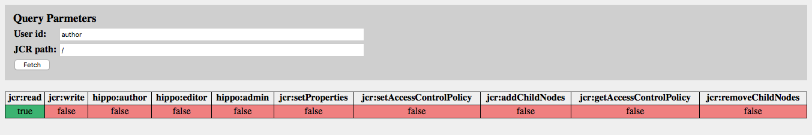

# hippo-permissions-servlet

A simple servlet for use with the CMS for displaying Hippo/JCR permissions on JCR nodes.

## Introduction

This servlet can be used within the Hippo CMS to display the permissions a given Hippo user has on a particular JCR node.

This servlet was derived from Hippo's servlets/src/main/java/org/hippoecm/repository/RepositoryServlet.java code, and extensively modified. Like the Repository Servlet, it uses HTTP Basic Authentication for gaining access to the servlet.

## Sample Screenshot



The above screenshot shows the results of fetching the permissions to the root node of the JCR repository ("/") for the "author" user.

As can be seen in the screenshot, after logging in, the servlet provides a very simple interface consisting of "User id" and "JCR Path" fields. 

| Field    | Description                                             |
| -------- | ------------------------------------------------------- |
| User id  | The Hippo user id to return the permission for          |
| JCR Path | The JCR path to the node to retrieve the permissions of |

The "Fetch" button causes the permissions for the given fields to be queried and returned in the table.

The permissions table consists of the individual permissions ("jcr:read", "jcr:write", "hippo:author", etc.) for the node. See the following documention for additional information about the permissions:

* [https://www.onehippo.org/library/concepts/security/repository-authorization-and-permissions.html]()
* [https://docs.adobe.com/content/docs/en/spec/jcr/2.0/16_Access_Control_Management.html]()

A value of "true" indicates the user has the permission, "false" indicates that the user does not.

## Integration with Hippo

The Permissions servlet has been designed to work with Hippo v7.9.12. It may work with other versions, but this has not been tested.

The servlet is intended to work with the Hippo CMS. It consists of a single jar file (hippo-permissions-servlet-[VERSION].jar), which can be added to the classpath of the web container in which the CMS runs. The following stanzas should be added to the web.xml file:

```
  <servlet>
    <servlet-name>PermissonsServlet</servlet-name>
    <servlet-class>edu.umd.lib.servlets.permissions.PermissionsServlet</servlet-class>
    <load-on-startup>6</load-on-startup>
  </servlet>
  
  <servlet-mapping>
    <servlet-name>PermissonsServlet</servlet-name>
    <url-pattern>/permissions/*</url-pattern>
  </servlet-mapping>
  
```
Once properly configured, the servlet should be accessible at [CMS URL]/permissions. For example, in a local development environment, the URL will likely be http://localhost:8080/cms/permissions.

## Integration with a Hippo Build

The Permissions servlet jar file is available from a Nexus repository maintained by the University of Maryland, College Park Library. To access the repository, add the following to your pom.xml file:

```
  <distributionManagement>
    <repository>
      <id>nexus</id>
      <name>Releases</name>
      <url>https://maven.lib.umd.edu/nexus/content/repositories/releases</url>
    </repository>
    <snapshotRepository>
      <id>nexus</id>
      <name>Snapshots</name>
      <url>https://maven.lib.umd.edu/nexus/content/repositories/snapshots</url>
    </snapshotRepository>
  </distributionManagement>
```

The dependency for the servlet is:

```
    <dependency>
      <groupId>edu.umd.lib.servlets</groupId>
      <artifactId>permissions-servlet</artifactId>
      <version>[VERSION]</version>
    </dependency>
```
where [VERSION] is the version number of the servlet to download.

## License

The Permissions servlet was created by copying and rewriting the Repository servlet available from Hippo. As such is is available under the Apache License v2.0. See [LICENSE]() for more information.

